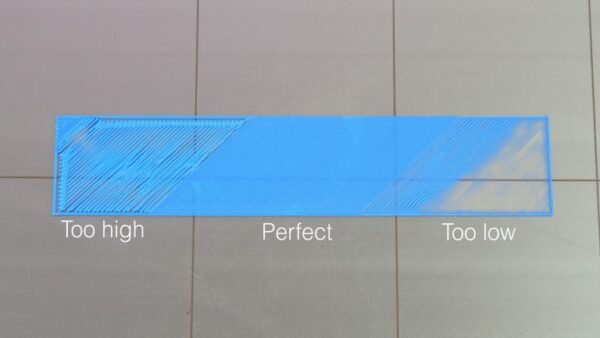

## Print Quality Troubleshooting Guide

[Print Quality Troubleshooting Guide](https://www.simplify3d.com/resources/print-quality-troubleshooting/)
## Hot End Components

[Anatomy of a Hotend](https://e3d-online.com/blogs/news/anatomy-of-a-hotend)
## Prusa MK3S

### Documentation
[Prusa MK3S Documentation](https://help.prusa3d.com/tag/mk3s)
### Cold Pull Procedure
[Cold Pull Procedure](https://help.prusa3d.com/article/cold-pull-mk3s-mk2-5s_2075)
### First Layer Calibration

[First Layer Calibration](https://help.prusa3d.com/article/first-layer-calibration-i3_112364)
### Nozzle Replacement

[Prusa Nozzle Change Procedure](https://help.prusa3d.com/article/changing-or-replacing-the-nozzle-mk2-5s-mk3s-mk3s-mk3-5_2069)
### STLs

#### Fan Shroud

[Fan Shroud](attachments/fan-shroud.stl)
#### Calibration Cube

[Prusa Calibration Cube](attachments/cube_prusa_v1.stl)
## LDO Voron 2.4 R2 Rev A

### [Setting Belt Tension](https://docs.vorondesign.com/tuning/secondary_printer_tuning.html#belt-tension)
### STLs

#### Test Grid

[Voron Test Grid](attachments/voron_test_grid_v2.stl)
#### Calibration Cube

[Calibration Cube](attachments/voron_design_cube_v7.stl)
## Configuration File Repository
- Requires Github account & invite to Prototyping Studio team
- Contains slicer profiles & klipper config files
[Config File Repo](https://github.com/Prototyping-Studio/3dPrinters/tree/main)
