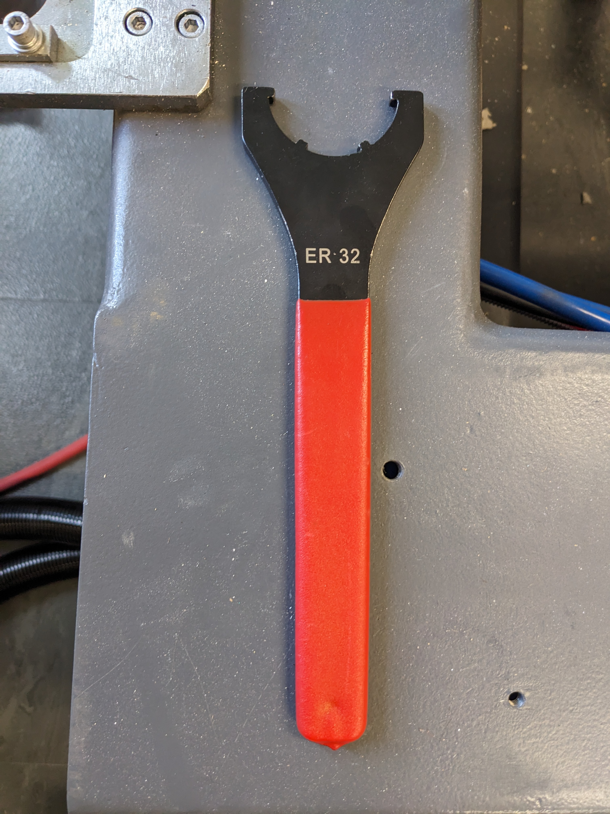
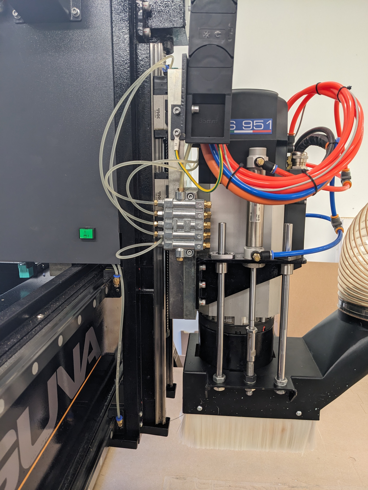

## Adding / Swapping Bits in Tool Change Rack

- Choose collet corresponding to bit shank diameter
	- Collet size engraved on front face
	- 1/8", 1/4", 3/8", 1/2" imperial sizes available
	- 4mm, 6mm, 8mm metric sizes available
- Tighten bit in collet by hand (clockwise)
	- All cutting flutes should be below collet
	- The bit shank should be inserted a minimum of 2/3 (100% ideal) of the collet length
		- For example, a 1.5" length collet requires at least 1" of bit shank inserted, however ideal insert length is 1.5"
- Finish tightening bit in collet using "ER 32" wrench & CNC tool mount bracket

- Press & hold green button on side of spindle
-  
- Position tool holder under spindle head
- Release green button

<iframe width="560" height="315" src="https://www.youtube.com/embed/HDV3oebI2bc?si=NWdhRKGc_imuj1HE" title="YouTube video player" frameborder="0" allow="accelerometer; autoplay; clipboard-write; encrypted-media; gyroscope; picture-in-picture; web-share" referrerpolicy="strict-origin-when-cross-origin" allowfullscreen></iframe>

- On the CNC screen, update the "current tool" number to reflect which tool position the new bit will be physically located in
- Park tool 
- Execute "Automatic Touchoff"
- Update Fusion cloud tool library to reflect new tool numbering
