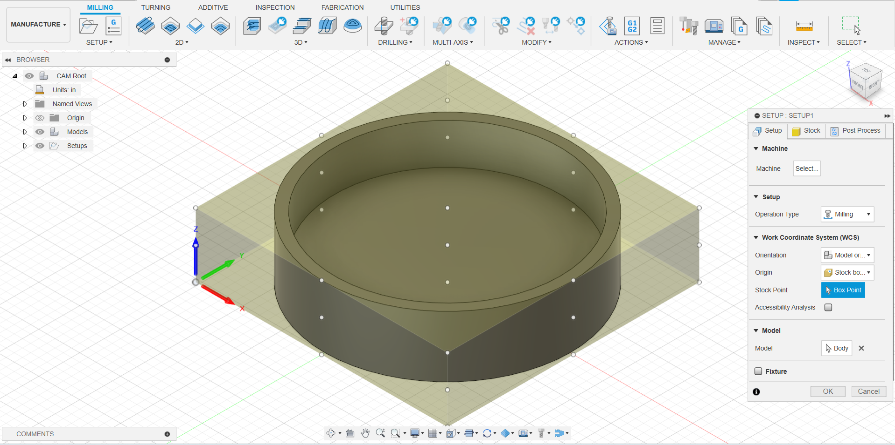

## Creating Setup
- Switch from "Design" to "Manufacturing" workspace in Fusion (top left corner)
- Setup > New Setup
- On "Setup" tab, set "Stock Point" to the BOTTOM corner of the stock
	- Previous instructions used top of stock & update bit length, this approach is not compatible with multi bit operations
- Still in "Setup" tab, select the model body/bodies to be machined

- In the "Stock" tab", select "Fixed Size Box" (preferred) or "Relative Size Box" (advanced)
- Set stock dimensions to actual measured values
	- Use calipers to measure stock thicknesses, inaccurate values can result in broken bits
	- X,Y dimensions are important but not as critical as material thickness (Z).
- If the model orientation doesn't fit within the specified stock, use a "Manufacturing Model" to rotate or re-arrange parts to fit.
	- [Manufacturing Model Overview](https://help.autodesk.com/view/fusion360/ENU/?guid=MFG-MANUFACTURING-MODEL-OVERVIEW)

