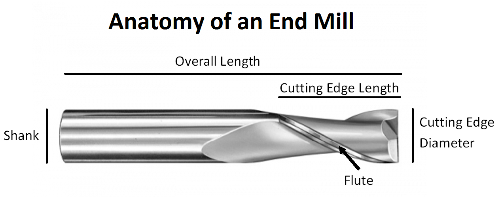

## Feeds & Speeds
- Many tool manufacturers provide feed & speed recommendations for their tools. These settings provide a good starting point and should be utilized when dialing in settings for new materials. It is important to note the RPM ratings on bits and not to exceed these values when setting up operations.
- Most of the tools used in the Laguna CNC are from Amana Tools. Amana has a Fusion 360 library of their bit offerings, including all the relevant numbers and measurements which describe the tools geometry (number of cutting flutes, length of flutes, bit diameter, etc).

## End Mill Anatomy

- https://www.endmill.com.au/blog/choosing-the-right-end-mill-for-the-job/ // selecting bits, good read, recommended 
- Amana Fusion 360 Tool Library
	- https://www.amanatool.com/view-amana-tool-fusion-360-library
	- [[Amana-Tool-Fusion-Master.tools)  // available via Prototyping Studio team cloud
- Sample bit
	- https://www.amanatool.com/46420-solid-carbide-spiral-plunge-3-8-dia-x-1-1-4-x-3-8-shank-down-cut.html?ff=1&fp=8806
- Sample feeds and speeds
	- [[Solid-Carbide-Spiral-Plunge-2-3-Flute-v26.pdf)
	- https://www.amanatool.com/pub/media/productattachments/Solid-Carbide-Spiral-Plunge-2-3-Flute-v26.pdf
