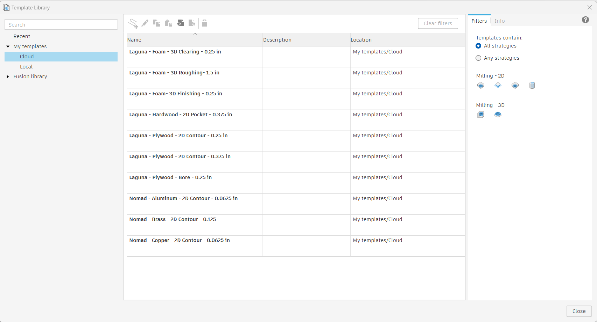
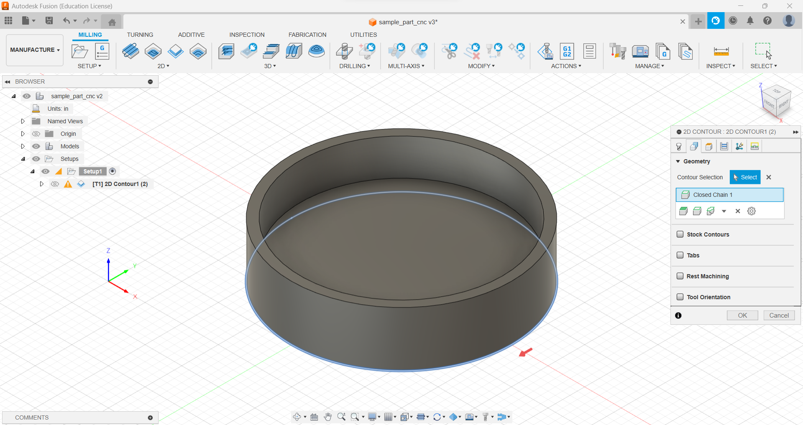
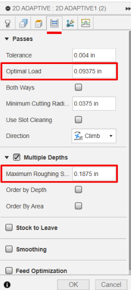

## Generate Tool Paths
- Tool paths should be generated immediately prior to cutting to ensure bit numbers have not changed.
	- If a tool path takes a long time to generate and/or must be generated in advance, make sure to verify each tool number in the operation vs the tools installed in the machine before starting a cut.
- Utilize template & bit library via Fusion 360 teams (requires invite to proto team) as much as possible
	- [Toolpath Template Library](https://help.autodesk.com/view/fusion360/ENU/?guid=MFG-REF-TOOLPATH-TEMPLATE-LIBRARY)
- Check template library for preset operations, for example 2D contour cut in plywood.
	- Make sure to select "Cloud" templates for most up to date feeds & speeds
	- These templates represent previous successful operations and should be utilized whenever possible.
	- Some operations have several bit size options, in general select the largest bit that meets detail requirements of the design.
	- Settings can be adjusted to meet project specific needs, if they differ significantly from the template settings, consider creating a new template.
	- Make sure to clear any "Selected geometries" in templates (if applicable) and update with geometries from current document
	- Templates use the following naming convention
		- Machine Name, Material, Operation Type, Bit Size
- Note, tool numbers in templates are NOT automatically updated and need to be verified against latest installed tools

### Toolpaths from Template
- Setup > Create From Template > Select Template

- Make sure "Cloud" templates are selected unless explicitly using a local template
	- Cloud libraries must be enabled ["(How to install a cloud tool library)"](https://www.autodesk.com/support/technical/article/caas/sfdcarticles/sfdcarticles/How-to-install-a-cloud-tool-library-in-Fusion-360.html)

- When selecting a contour cut, pay attention to which side of the cut line the bit is on (indicated w/ a red arrow). Clicking on the red arrow will change where the bit cuts relative to the indicated contour line.

### Toolpaths from Scratch

- 2D Adaptive preferred over 2D Pocket, high speed machining (HSM) limits how much of the bit is cutting at a given time, improving tool life and reducing breakage
	- [2D Adaptive Clearing Reference](https://help.autodesk.com/view/fusion360/ENU/?guid=GUIDA73542E9-ED9C-4BD9-A87D-3A0ECA8BEB41)
	- Optimal load: 0.25 x tool_diameter
	- Depth of cut: Max 50% diameter of tool

#### 2D Adaptive
- Critical parameters
	- Tool Tab
		- Feed per tooth
			- Indicates how much material is each revolution by each cutting edge when the machine is performing a normal cut, typical values range from (0.002 to 0.01")
		- Plunge Feed per Revolution
			- Same as feed per tooth but specific to vertical cutting/drilling, end mills have different geometry than drill bits and are not as efficient cutting straight down into material. Typical values are ~50% of the feed per tooth value (0.001 to 0.005")
	- 
	- Passes Tab
		- Optimal Load
			- Indicates the maximum amount of tool engagement, as a rule of thumb this value should be approximately 25% of the tool diameter
				- For example, a good starting point for a 3/8" endmill is 0.09375" (0.375 * 0.25)
			- This value can be increased or decrease when machining harder/softer materials (lower for hard materials, higher for soft materials)
		- Maximum Roughing Stepdown
	- 

