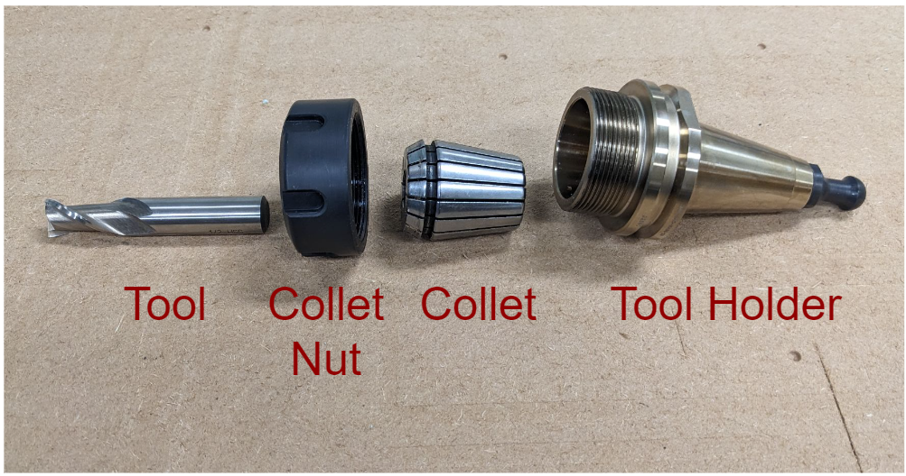
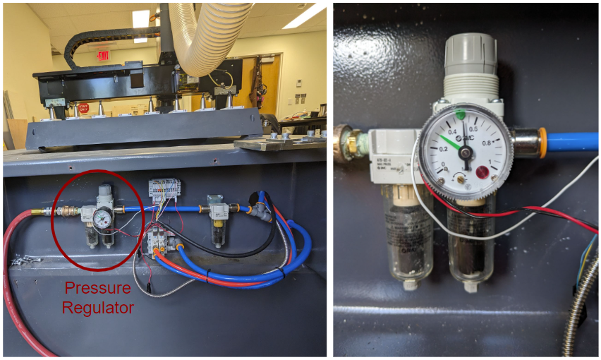
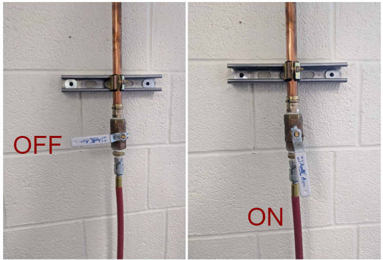

## Hardware
### Body

### Tool Head

### Tool Holder Assembly

### Tool Rack

Tool rack has space for up to 8 tools, numbered 1-8 (left to right as viewed from front)
### Pressure Regulator

### Air Inlet

### Control Box

- Vacuum Table - Vacuum Pump 1
- Position Rods - Helps with stock alignment
- E-Stops - Main panel & remote
- Remote - Used to manually position tool head during setup, also has an E-stop
- Lubricant pump - keeps rails lubricated, activate a few seconds, then manually jog toolhead with remote
