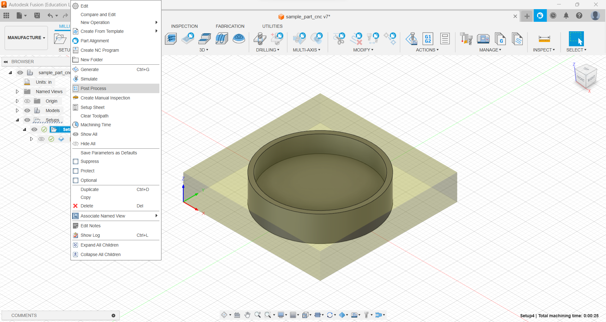
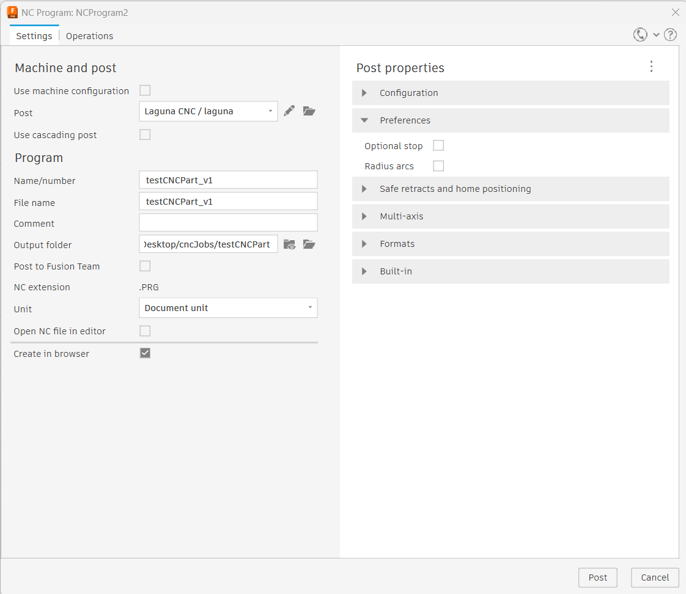

## Post Processing
- Post processing creates the gcode file for a specific CNC
- For setups with multiple operations, can either generate a single file or multiple files
- If a single file is used with multiple bits, the Laguna automatic tool change (ATC) system will swap bits when each operation is complete.
	- As previously noted, for the ATC system to work properly and avoid damage to equipment/stock, setup origin must be located at the bottom of the stock and all bits must be zero'd to the spoilboard using the "Automatic Touch Off" buttom on the Laguna Control Screen.
- Consider using multiple individual files when
	- Individual operations are estimated to take a long time (estimated machining times are shown in the bottom right corner of the screen)
	- Manual tool changes are required
	- Parts need to be inspected after an operation before proceeding

- The "Post Processing" screen allows the output files to be named (if not already configured via the Setup > Post Processing tab) and specifies an output directory for the gcode file (.PRG)
- Make sure the "Laguna CNC / laguna" post processor is selected, if not use the navigator to find it via Fusion's cloud library.
- The units should be set to "Document unit" to ensure tool paths are scaled correctly.
- Select "Post" to generate the gcode
- Copy the output file to a USB drive for use in the CNC Control System

