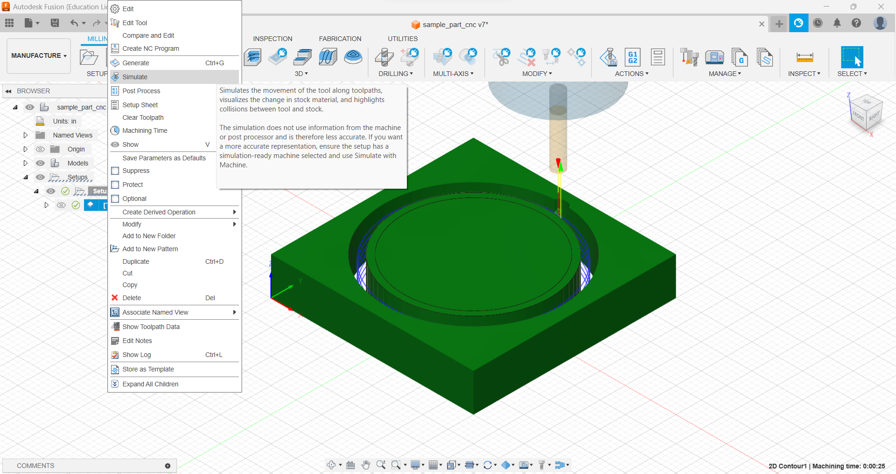
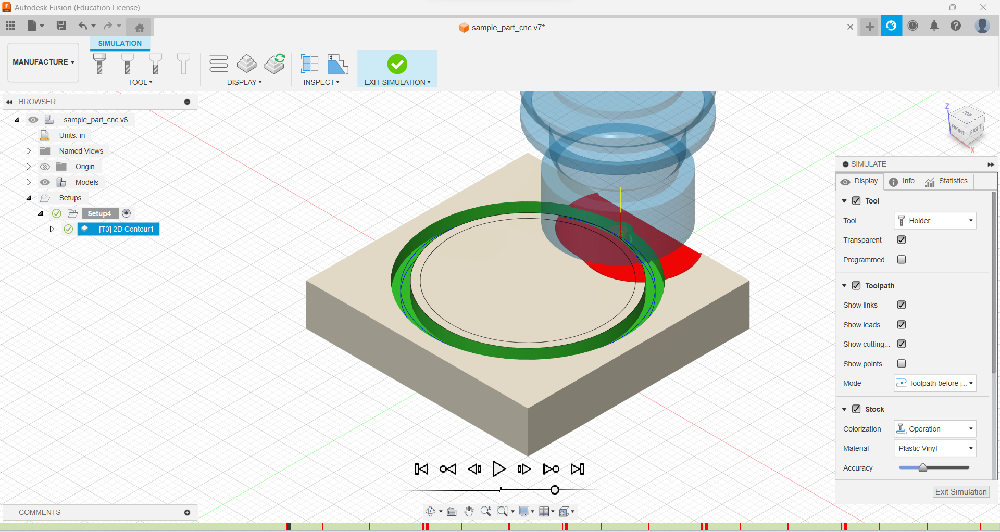

## Simulation
- All generated tool paths should be simulated prior to post processing
- Individual or multiple tool paths can be simulated by selecting desired operations (or setup for all), then selecting "Simulate"

- Use the play/pause buttons at the bottom of the screen to preview the operations.
- Watch for any errors/warnings in simulation timeline (indicated by vertical red lines)
- Do NOT post process any operation that has simulation errors, it could result in damage to equipment and/or stock. 
- Hovering over errors will give a description of issue that must be addressed in the tool path settings.

