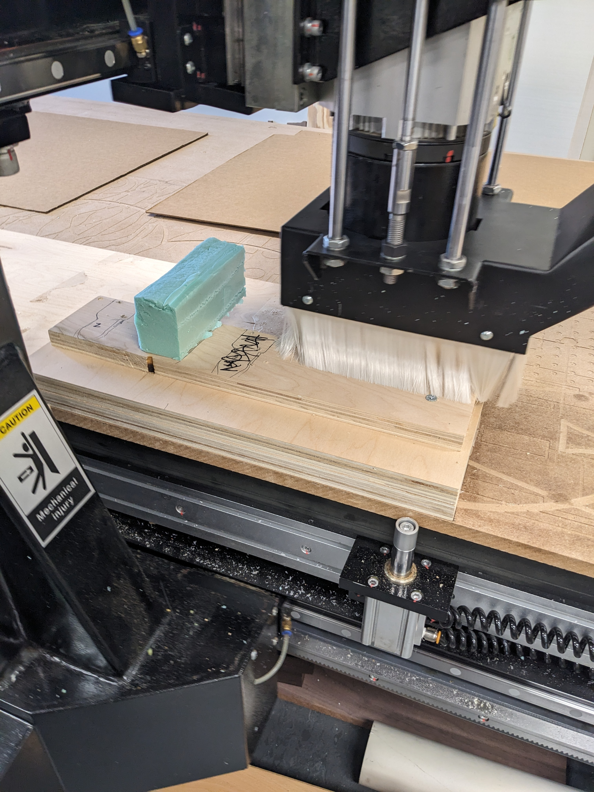
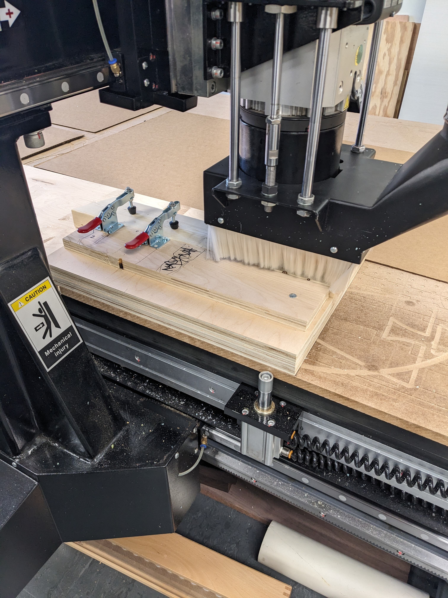

## Work Holding
 - Proper work holding is critically important, particularly for small pieces. It is very easy for a piece to come lose and come into contact with the mill bit, causing damage to the work piece and potentially damage the bit.
 - There are many options for work holding including available and should be utilized on a per job basis.
	 - Double sided tape
	 - Tabs (configurable in Fusion 360)
		 - [Tabs reference](https://help.autodesk.com/view/fusion360/ENU/?guid=MFG-REF-2D-CONTOUR-TABS)
	 - Clamps / Fixtures
	 - Screws / Staples
	 - Vacuum
- When utilizing work holding that could interfere with the mill bit, caution must be taken to ensure the clamps/fixtures will not collide with the tool head.  
- Soft materials such as foam blocks can be used to mock up actual clamps for verification.
	- We won't actually be cutting material at this point, we will only "cut air".
	- We will run the operations and observe whether any part of the tool head contacts the foam blocks.
	- If the operation completes issue, we will install clamps in the EXACT space where the foam was located.

