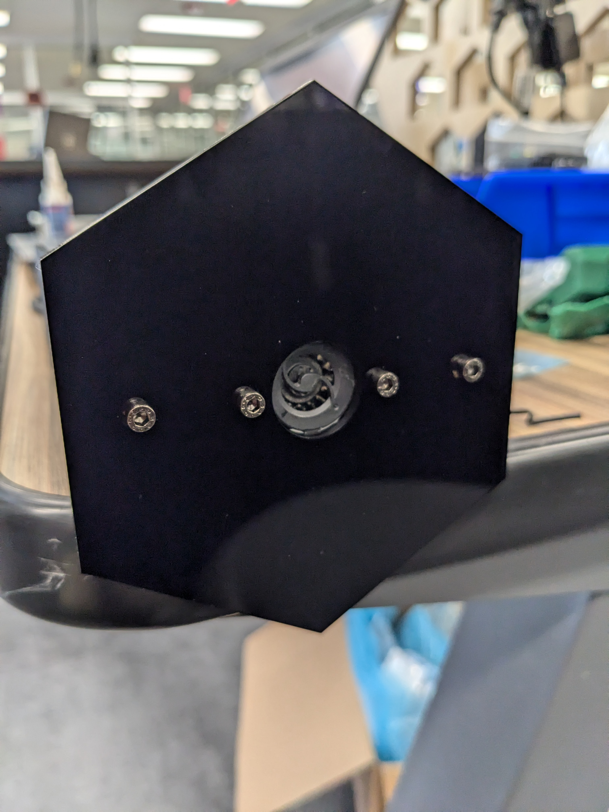

## Air Quality Node

### Hardware
SGP30 Air Quality Sensor <https://www.adafruit.com/product/3709>

Arduino "Metro Mini" <https://www.adafruit.com/product/2590>

### Sample Code
<https://github.com/Prototyping-Studio/demoBoardPublic/blob/master/air_quality_demo/air_quality_demo.ino>

