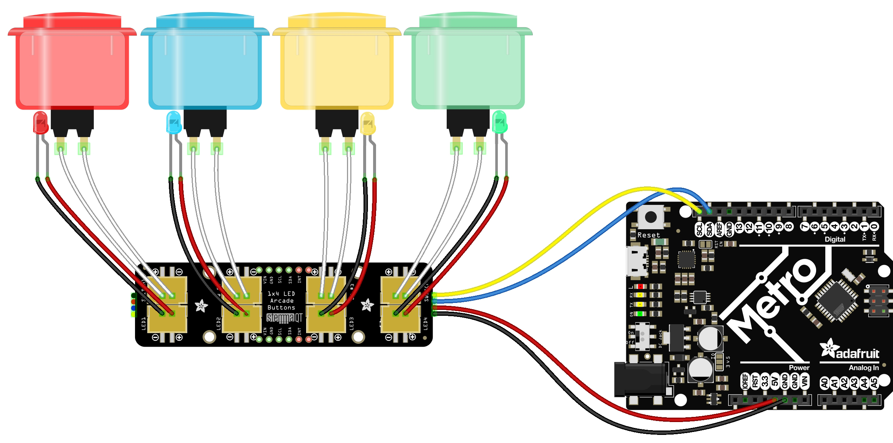

## Arcade Button Node

### Hardware
Arcade Button Breakout <https://www.adafruit.com/product/5296>

Arcade Button <https://www.adafruit.com/product/3430>

Arduino "Metro Mini" <https://www.adafruit.com/product/2590>

### Sample Code
<https://github.com/Prototyping-Studio/demoBoardPublic/blob/master/arcade_button_demo/arcade_button_demo.ino>
<https://github.com/Prototyping-Studio/demoBoardPublic/blob/master/arcade_button_demo/ButtonLED.h>

