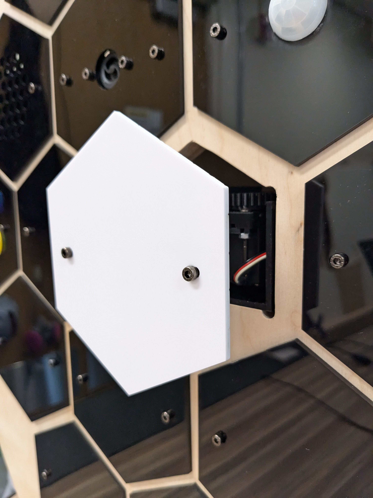
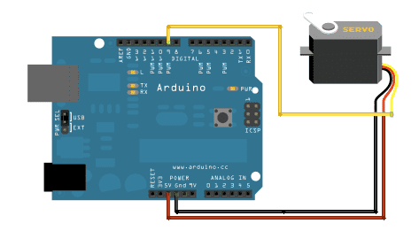

## Servo / Linear Actuator Node

### Sample Code
<https://github.com/Prototyping-Studio/demoBoardPublic/blob/master/servo_demo/servo_demo.ino)>

### Hardware
<https://www.thingiverse.com/thing:3170748>

### Wiring

