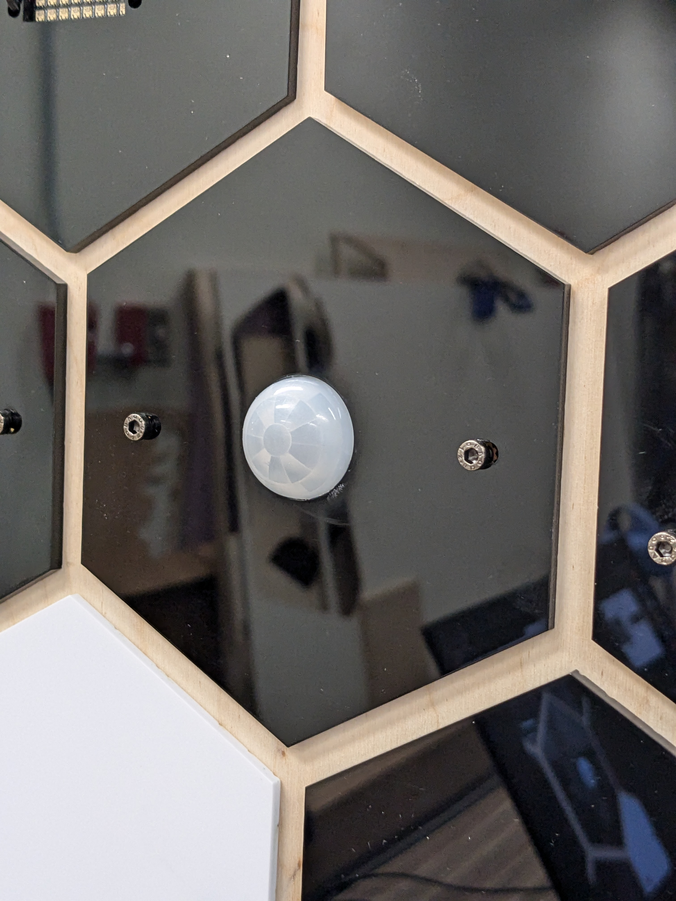

## PIR Node

### Sample Code
[Sample Code](<https://github.com/Prototyping-Studio/demoBoardPublic/blob/master/pir_demo/pir_demo.ino)

### Hardware
<https://learn.adafruit.com/pir-passive-infrared-proximity-motion-sensor?view=all>
